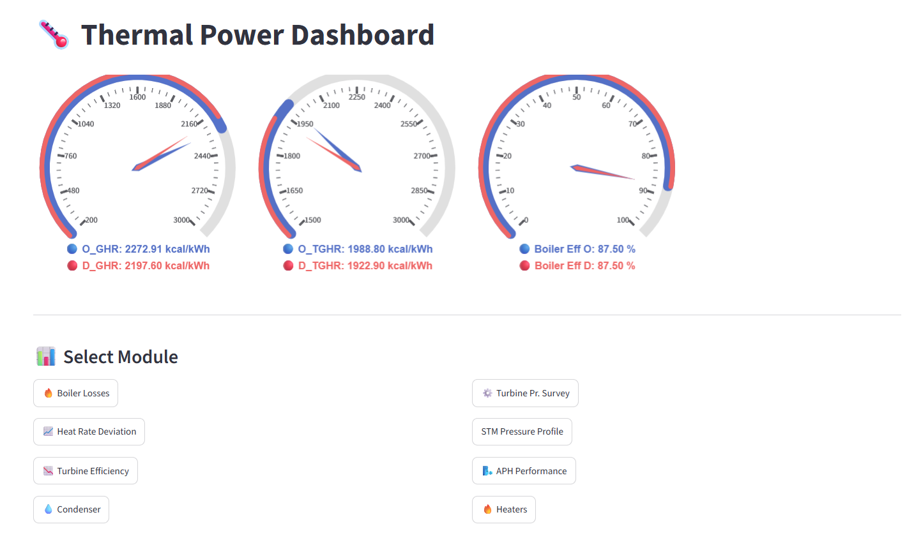
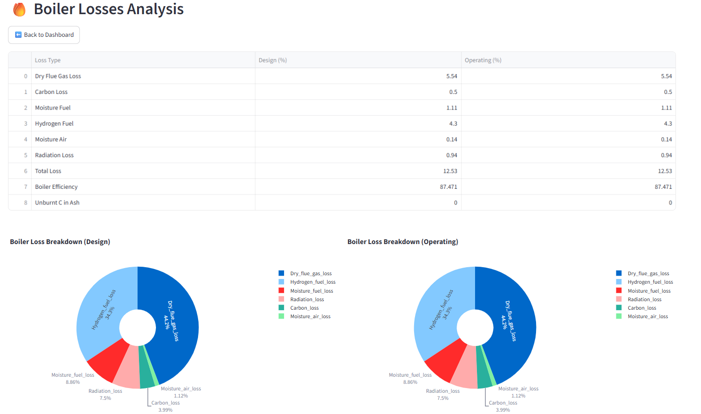
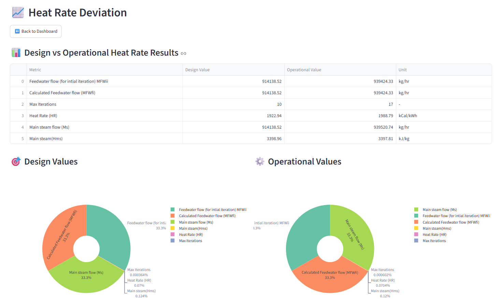
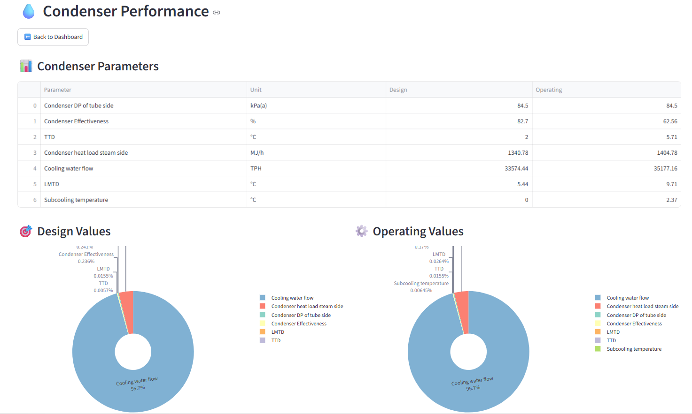
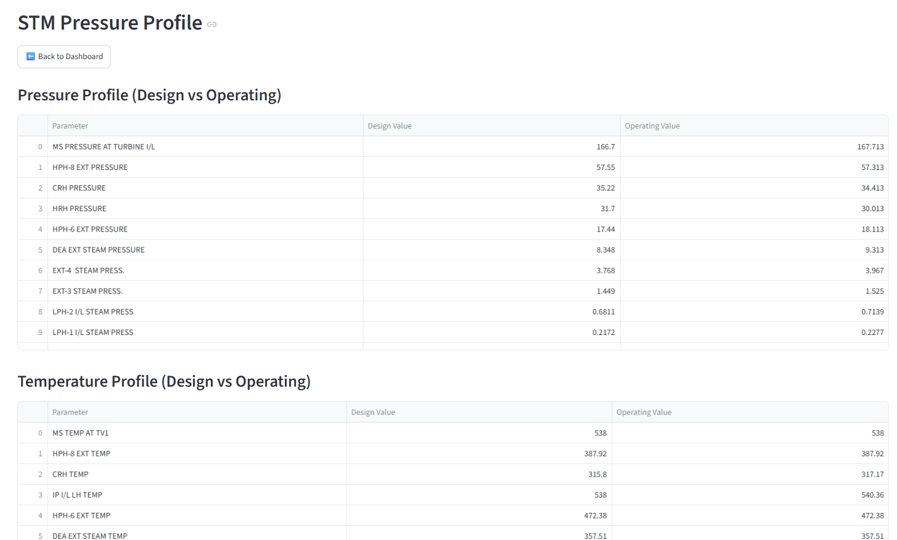
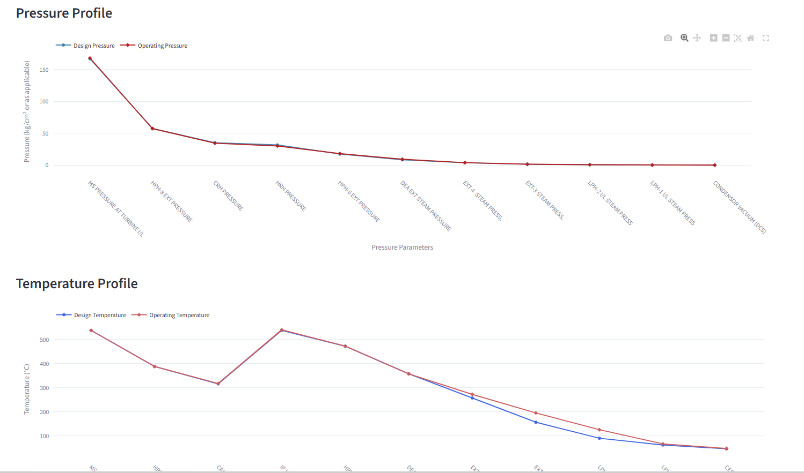
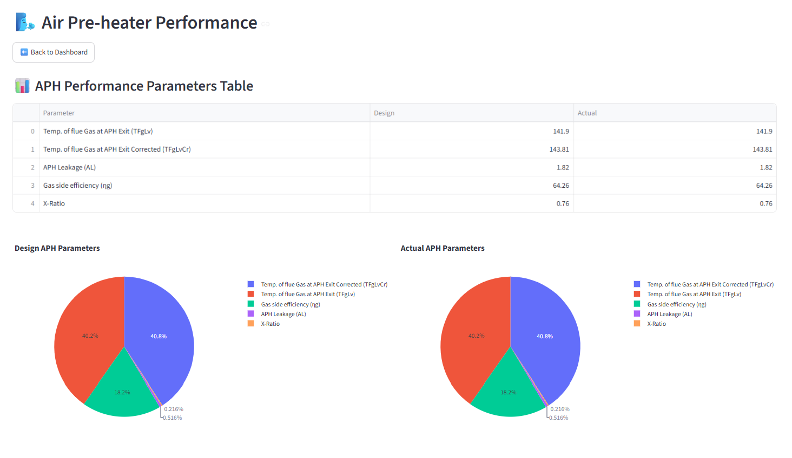
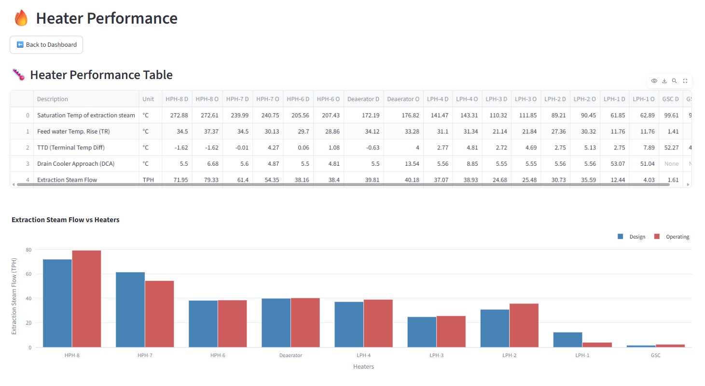
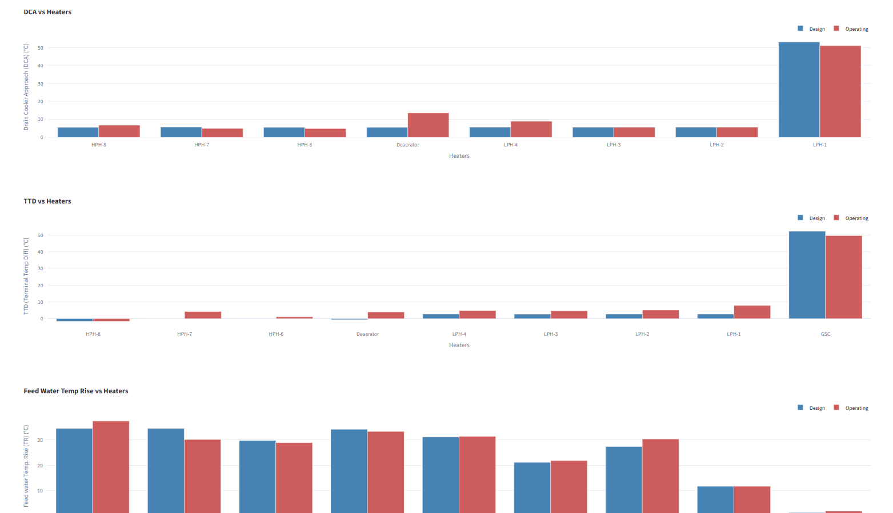

# Thermal-Tool

A Streamlit-based Thermal Engineering application for modeling, simulation, and performance analysis of thermal systems.

This tool provides engineers and researchers with an interactive platform to solve heat transfer, mass transfer, cooling tower, dehumidification, and thermal performance problems through an intuitive web interface.

---

## 🚀 Features

- Interactive Streamlit Dashboard
- Thermal System Modeling
- Heat Transfer Calculations
- Mass Transfer Analysis
- Cooling Tower Design and Simulation
- Air Dehumidification Tower Modeling
- Performance Visualization
- Engineering Graphs and Profiles
- Customizable Input Parameters
- Real-Time Calculations

---

## 📊 Modules
 
### 🔥 Boiler Efficiency Module
- Direct and Indirect Efficiency Calculation
- Boiler Performance Monitoring
- Efficiency Trend Analysis
- Heat Loss Evaluation
 
### 📈 Heat Rate Analysis Module
- Gross Heat Rate Calculation
- Net Heat Rate Calculation
- Design vs Actual Comparison
- Heat Rate Deviation Monitoring
 
### 💨 Steam Pressure Profile Module
- Steam Pressure Distribution Analysis
- Pressure Drop Monitoring
- Profile Visualization
- Performance Assessment
 
### 🌊 Condenser Performance Module
- Condenser Vacuum Monitoring
- Condenser Efficiency Analysis
- Cooling Water Performance Evaluation
- Heat Rejection Assessment
 
---
 
## 🚀 Key Features
 
- Interactive Streamlit Dashboard
- Thermal Power Plant Performance Analysis
- Boiler Efficiency Evaluation
- Heat Rate Monitoring
- Steam Pressure Profile Analysis
- Condenser Performance Assessment
- Real-Time Engineering Calculations
- Interactive Graphs and Visualizations
---

## ⚙️ Input Parameters

Typical inputs include:

- Temperature (°C)
- Humidity Ratio (kg/kg)
- Air Flow Rate
- Water Flow Rate
- L/G Ratio
- Heat Transfer Coefficients
- Mass Transfer Coefficients
- Operating Conditions

---

## 📈 Outputs

The application generates:

- Tower Height
- Temperature Profiles
- Humidity Profiles
- Saturation Curves
- Operating Lines
- Performance Metrics
- Engineering Charts

---

## 🛠️ Technology Stack

- Python
- Streamlit
- NumPy
- Pandas
- SciPy
- Matplotlib

---

## 📦 Installation

Clone the repository:

```bash
git clone https://github.com/bhaskar08092000/Thermal-Tool.git
```

Move to project folder:

```bash
cd Thermal-Tool
```

Install dependencies:

```bash
pip install -r requirements.txt
```

---

## ▶️ Run the Application

```bash
streamlit run app.py
```

or

```bash
python -m streamlit run app.py
```

---

## 🎯 Applications

- Thermal Power Plants
- Cooling Tower Design
- HVAC Systems
- Chemical Process Engineering
- Heat & Mass Transfer Studies
- Academic Projects
- Engineering Research

---

## 👨‍💻 Author

**Bhaskar Kewalramani**  
Senior Engineer

GitHub: https://github.com/bhaskar08092000

---

## License

This project is licensed under the MIT License.

## 📷 Screenshots

### Screenshot 1


### Screenshot 2


### Screenshot 3


### Screenshot 4


### Screenshot 5


### Screenshot 6


### Screenshot 7


### Screenshot 8


### Screenshot 9

